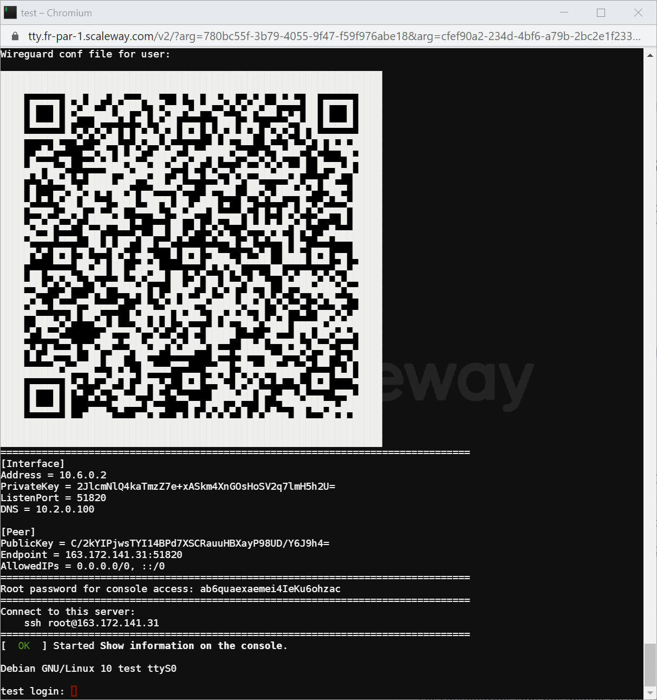

# wireguard-vps



Script to instanciate in ~3min a [Scaleway](https://www.scaleway.com/) VM as [Wireguard VPN](https://www.wireguard.com/) with [Unbound](https://nlnetlabs.nl/projects/unbound/about/) and [Pi-hole](https://github.com/pi-hole), using [cloud-init](https://cloudinit.readthedocs.io/en/latest/) facilities.

[Scaleway](https://www.scaleway.com/) is a french cloud provider with affordable costs.

```
                   .-~~~-.              ┌──────────────────────────────────────┐
           .- ~ ~-(       )_ _          │VPS                                   │
          / Internet           ~ -.     │  ┌────────────┐   DNS                │
         |                       ◄──────┼──┤Unbound     ◄────────┐             │
          \                    ▲    .'  │  │(DNS solver)│        │             │
            ~- ._ ,..,.,.,., ,.│ -~     │  └────────────┘        │             │
                            '  │        │                 ┌──────┴─────┐       │
┌────────────────────┐         │        │                 │Pi-Hole     │       │
│ PC/Phone           │         │        │                 │(DNS filter)│       │
│                    │         │        │                 └──────▲─────┘       │
│    ┌─────────┐     │         │        │    ┌─────────┐         │             │
│    │Wireguard│     │         └────────┼────┤Wireguard├─────────┘             │
│    │ Client  │     │                  │    │ Server  │  DNS                  │
│    │         │   ──┴──────────────────┴─   │ (VPN)   │                       │
│    │         ├──►      VPN Tunnel       ───►         │   ┌────────────────┐  │
│    └─────────┘   ──┬──────────────────┬─   └─────────┘   │Watchtower      │  │
│                    │                  │                  │(images updater)│  │
└────────────────────┘                  │                  └────────────────┘  │
                                        │                                      │
                                        └──────────────────────────────────────┘
```

## How to create a wireguard + Unbound + PI-hole VM

__Prerequisites__:
- a [Scaleway account](https://console.scaleway.com/register)
- [scaleway-cli](https://github.com/scaleway/scaleway-cli), using your account (`scw init` done)

```bash
vm_name=test zone=fr-par-1 type=STARDUST1-S ./create-scw-wireguard_pi-hole_unbound.sh
```

Note the parameters `vm_name`, `zone` and `type` in the command-line.
Default values will be `wireguard-vps`, `nl-ams-1` and `DEV1-S` otherwise.


__NB__: [ctrl]+[q] to close the VM console attached to your terminal.


## What it does

This [script](./create-scw-wireguard_pi-hole_unbound.sh) will:
- check the availability for this VM type
- create a VM
- attach the console to the running terminal
- run the [cloud-init script](./cloud-init/wireguard_pi-hole_unbound.sh).


## The cloud-init part

The [cloud-init script](./cloud-init/wireguard_pi-hole_unbound.sh) will:
- upgrade the OS
- install docker and other things (fail2ban, ...)
- generate a random password for root
- create a config file for Unbound
- create an application stack composed of Unbound, Wireguard, Pi-Hole and Watchtower using docker-compose
- set a service to print the needed information on the server console
- reboot the OS.


## The docker-compose stack

Very largely inspired/copied from [IAmStoxe/wirehole](https://github.com/IAmStoxe/wirehole), but modified and a bit simplified according to my needs.

The docker-compose stack relies on:
- [mvance/unbound](https://github.com/MatthewVance/unbound-docker)
- [linuxserver/docker-wireguard](https://github.com/linuxserver/docker-wireguard)
- [pihole/pihole](https://github.com/pi-hole/pi-hole)
- [containrrr/watchtower](https://github.com/containrrr/watchtower)

Thanks to them for building these docker images, and of course to people involved in these projects.


## How to connect to the VM

Open the console on your VM using the [Scaleway console](https://console.scaleway.com/) and restart the VM if you need to retrieve the root password and/or the wireguard information.


## How to list available VM types by zone

```bash
for zone in fr-par-1 fr-par-2 fr-par-3 nl-ams-1 pl-waw-1
do
  echo -e "\n== $zone ==\n"
  scw instance server-type list --output=human zone=$zone
done
```
